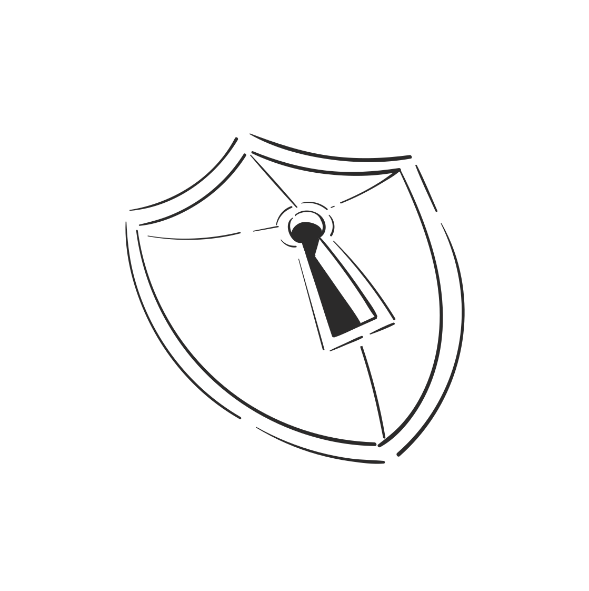

<!-- _class: title-slide -->

AETHER SHIELD • Computers and Network Security • MAY 2026

<h1>AETHER SHIELD</h1>

Secure Authentication System

Technical presentation on enterprise-grade cryptographic security architecture featuring zero-knowledge authentication, memory-hard hashing, and constant-time verification.

[ Zero-Knowledge Auth ]
[ Memory-Hard Hashing ]
[ Constant-Time Verification ]

  

<!-- 
AETHER SHIELD • Computers and Network Security • MAY 2026
 -->

---

## Introduction & Core Objectives

The **Aether Shield** project implements industry-standard cryptographic best practices to protect user credentials and mitigate common authentication vulnerabilities.

**Core Security Concepts:**
- **Zero-Knowledge Architecture:** The 1system never knows or stores the actual password in plaintext.
- **Rainbow Table Defense:** Neutralization of pre-computed dictionary attacks via unique cryptographic Salts.
- **Timing Attack Mitigation:** Thwarting side-channel attacks using constant-time string comparisons.
- **Brute-Force Defense:** Dynamic Lockout Policies stopping automated credential stuffing attacks.
- **Modern Cryptography:** Integrating `PBKDF2`, `bcrypt`, and the memory-hard `Argon2id`.

---

## System Architecture

The application employs a modular design, decoupling the web interface from the core cryptographic engine to maintain a secure boundary.

- **`app.py` (Web Server & Routing):** 
  The Flask entry point. Handles HTTP requests, API endpoints (`/api/login`, `/api/register`), and manages secure `HTTPOnly` cookies for session tracking.
- **`auth_manager.py` (Security Engine):** 
  The cryptographic heart. Manages all hashing logic, in-memory session tracking (`ACTIVE_SESSIONS`), and comprehensive audit logging.
- **JSON Data Stores:** 
  Lightweight `users.json` and `audit_log.json` handle persistent account configurations (salts, hash algorithms, digests) and chronological security events.

---

## Role-Based Access Control (RBAC)

Aether Shield enforces strict access control through two distinct privilege tiers:

**1. User Privileges**
- Secure account registration, login, and safe logout (invalidating the active session token).
- Password recovery via securely hashed security questions.

**2. Admin Privileges**
- Access to a restricted, authenticated Admin Dashboard.
- View registered users and inspect their security configurations.
- Manually unlock accounts disabled by the automated lockout policy.
- Elevate or demote user roles, and delete anomalous accounts.
- Review chronological Audit Logs for intrusion detection.

---

## Encryption vs. Hashing

Understanding the fundamental mathematical differences is critical.

### Encryption (Two-Way)
- Obfuscates plaintext into ciphertext using an encryption key.
- **Reversible:** Can be decrypted back to plaintext with the correct key.
- **Flaw for Passwords:** If the database and the key are breached, all passwords are exposed instantly.

### Hashing (One-Way)
- Maps an input of any size to a fixed-size bit string (digest).
- **Irreversible:** Computationally infeasible to reverse engineer the plaintext.
- **Zero-Knowledge:** The server only stores the hash. During login, it hashes the input and compares it, never knowing the actual password.

---

## Rainbow Tables & Salting

### The Threat: Rainbow Tables
A Rainbow Table is a massive, precomputed database of password hashes. Attackers use it to perform high-speed lookups on stolen password hashes, instantly cracking common passwords.

### The Solution: Cryptographic Salting
A **salt** is a secure, random 16-byte sequence uniquely generated for every user.
- **Formula:** `Hash(Password + Salt) = Stored Hash`
- **Exploding the Keyspace:** Appending a unique salt means an attacker cannot use a single precomputed table for multiple users. They must compute a new table for every possible salt, which requires financially impossible computing power.

---

## Timing Attacks & Constant-Time Comparisons

### The Vulnerability: Standard `==` Operator
Standard string comparison evaluates character-by-character and uses **early-exit optimization** (it stops at the very first mismatched character). 
- *Leakage:* Attackers measure response times in microseconds. A longer response time indicates a longer matching prefix, allowing them to guess the secret character by character.

### The Defense: `secrets.compare_digest()`
Aether Shield uses constant-time comparison algorithms.
- Processes the entire sequence regardless of where a mismatch occurs.
- CPU cycles spent remain constant, eliminating measurable time differentials and neutralizing side-channel timing attacks entirely.

---

## Modern Hashing: bcrypt vs. Argon2

Why is standard **SHA-256** unacceptable for passwords? 
- **Speed:** Modern GPUs compute tens of billions of SHA-256 hashes per second, making offline brute-forcing trivial.

**Adaptive Alternatives:**
- **bcrypt:** Employs a configurable *Work Factor*. By increasing iterations, administrators intentionally slow down the hashing process (e.g., to ~100ms), dropping crack rates from billions to thousands per second.
- **Argon2 (Argon2id):** The state-of-the-art standard. It introduces **Memory-Hardness**. Computing an Argon2 hash requires significant RAM bandwidth, instantly starving highly parallel GPU and ASIC cores, erasing the hardware advantage.

---

## Cryptographic Algorithm Comparison Matrix

| Hashing Algorithm | Category | Iteration Control | Memory-Hardness | Resists GPU/ASIC Cracking | Production Suitability |
| :--- | :--- | :--- | :--- | :--- | :--- |
| **SHA-256** | Cryptographic Hash | None (Fixed) | None ($0$ RAM) | **No** (Vulnerable) | **UNACCEPTABLE** |
| **PBKDF2** | Key Derivation | Yes (Iterations) | None ($0$ RAM) | **Weak** (GPU parallelizable) | **Legacy / Minimum** |
| **bcrypt** | Password Hash | Yes (Work Factor) | Negligible | **Yes** (Strong CPU limits) | **Good** (Standard) |
| **Argon2id** | Modern KDF | Yes (Time Cost) | Yes (Memory Cost) | **Excellent** (Best-in-class) | **Exceptional** (Recommended) |

---

## Team Members

  

  

    
1. محمد أحمد محمد عطية

    
2. محمد أحمد محمد الجزار

    
3. محمد خالد فتحي بدر

    
4. محمد خالد محمد العبادي

    
5. مؤمن أحمد طه الشعراوي

  

---

# Thank You
**Aether Shield** successfully demonstrates that robust authentication requires layers of mathematical and architectural defenses.

  
  <h3 class="thanks-questions">Any Questions?</h3>

<!-- ---

## Future Enhancements

- **Biometric Integration:** Support for WebAuthn and hardware security keys.
- **Advanced Threat Intelligence:** Real-time analysis of authentication requests using ML models.
- **Decentralized Identity:** Exploring blockchain-based identity verification. -->
